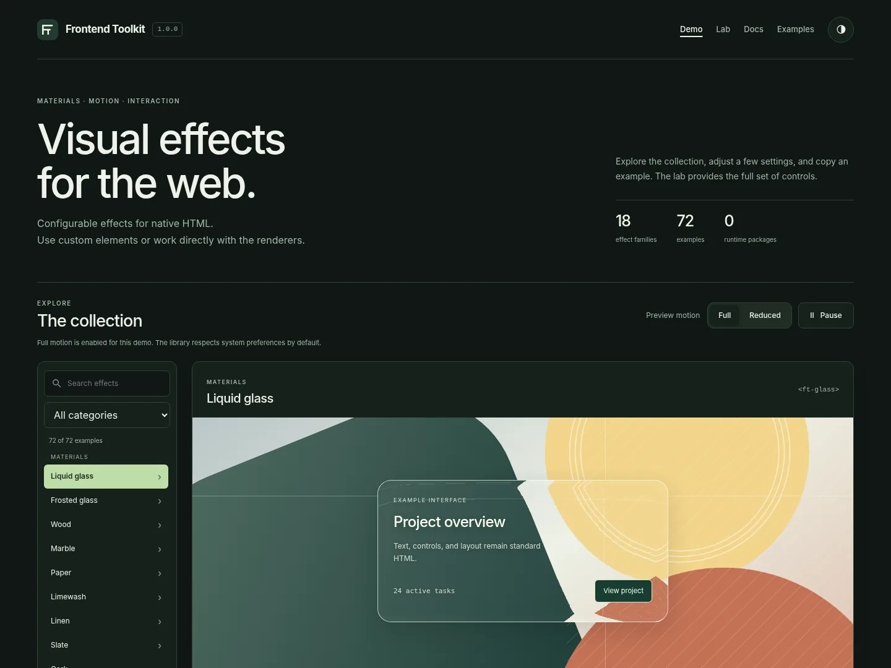

# Frontend Toolkit

Configurable visual effects for native HTML elements: materials, borders, atmospheric backgrounds, pointer interactions, and loading indicators.

Use custom elements for declarative integration, attach an effect to an existing element, or import individual renderers. No runtime framework or third-party JavaScript package is required.

<!-- repository-links:start -->
[Demo](https://budhi-halim.github.io/frontend-toolkit/) · [Full lab](https://budhi-halim.github.io/frontend-toolkit/lab.html) · [Repository](https://github.com/budhi-halim/frontend-toolkit) · [Integration guide](docs/GETTING_STARTED.md) · [API reference](docs/API.md)

Hosted links become available only after the corresponding repository and site are published.
<!-- repository-links:end -->



## Quick start

Copy `dist/frontend-toolkit.js` into your project, load it once, and give the element a size:

```html
<script src="./dist/frontend-toolkit.js" defer></script>

<ft-glow preset="prism" class="card">
  <h2>Project overview</h2>
  <p>Standard HTML with an animated border.</p>
</ft-glow>

<style>
  .card {
    display: block;
    min-height: 180px;
    padding: 2rem;
    border-radius: 20px;
  }
</style>
```

The script registers the `ft-*` elements. Effect decoration is separate from the element's HTML content. Style your content normally; the library does not supply a component layout or typography system.

The normal motion policy follows `prefers-reduced-motion`. The public demo intentionally starts in full motion and provides a Reduced switch for comparison. That override is not included in copied examples.

## Effects

| Area | Families and examples |
| --- | --- |
| Materials | Liquid and frosted glass; wood, marble, paper, linen, plaster, stone, cork, and sand |
| Nature | Water, inside/outside fire, smoke, clouds, aurora, open sea, snowfall, leaves, petals, and seeds |
| Borders and feedback | Constant-distance glowing borders, spotlight, sheen, ripple, foil, and edge light |
| Interaction | Pointer trails, fluid injection, and locally responsive liquid metal |
| Backgrounds | Mesh gradients, bokeh, light shafts, window/leaf shadows, wave dividers, and contours |
| Patterns | Dots, grids, crosses, hexagons, diagonals, halftones, arches, and tiles |
| Loading and progress | Skeletons, progress rings/bars, segmented progress, loading dots/rings, and activity bars |
| Atmospheric and procedural art | Rain, nebula, lava, iridescence, silk, interference, tunnels, constellations, and lightning |

The demo contains 76 examples across 19 renderer families. Presets are configurations, not separate runtime dependencies. Snow, autumn leaves, petals, and drifting seeds are available through `ft-fall`. The [option reference](docs/OPTIONS.md) lists every supported setting and preset.

## Selective loading

Use the module loader instead of the complete classic bundle to fetch effect implementations as needed:

```html
<script type="module" src="./dist/frontend-toolkit.loader.js"></script>

<ft-fire preset="hearth" loading="visible" class="fire-panel">
  <h2>Example content</h2>
</ft-fire>

<style>
  .fire-panel { display: block; min-height: 280px; border-radius: 20px; }
</style>
```

Keep `dist/modules/` beside the loader, from the same release. Selective loading and ES modules require HTTP(S); use the supplied local server during development. Use **one entry point**, not both the classic and selective scripts.

Supported element loading modes are `eager`, `visible`, `load`, `idle` (also `background`), and `manual`. Deferred loading is not a Web Worker. See [Loading](docs/GETTING_STARTED.md#selective-loading).

## JavaScript control

```js
const element = document.querySelector('ft-fire');
await customElements.whenDefined('ft-fire');

element.configure({ flameSpeed: 2.5, flickerSpeed: 1.2 });
element.pause();
element.play();
```

For an existing element:

```js
import { mountEffect } from './dist/frontend-toolkit.esm.js';

const effect = mountEffect(document.querySelector('.button'), {
  effect: 'highlight',
  preset: 'ripple',
  activation: 'click'
});

// When removing the component:
effect.destroy();
```

Managed effects handle scheduling, resizing, visibility, motion policy, and cleanup. Individual renderer exports let an application own those responsibilities instead. See the [API reference](docs/API.md).

## CDN distribution

<!-- cdn-example:start -->
After the repository and the matching tag exist:

```html
<script src="https://cdn.jsdelivr.net/gh/budhi-halim/frontend-toolkit@v1.0.0/dist/frontend-toolkit.js" defer></script>
```

This is a versioned URL template; this command does not publish the tag or verify that the URL is live.
<!-- cdn-example:end -->

Use an exact release tag or commit, not a moving branch, for deployed sites. Keep all imported files on the same release. See [jsDelivr's GitHub documentation](https://github.com/jsdelivr/jsdelivr#github).

## Local development

Use Node.js 24 LTS (22 or newer is supported). Node and the minifiers are development tools, not browser dependencies. VS Code Live Server remains usable.

```sh
npm install       # First setup; creates package-lock.json. Commit it.
npm run build     # Minified dist + generated build/site
npm run verify    # Production structure, reproducibility, and Node tests
npm run preview   # Serve generated website at /frontend-toolkit/
```

Clean clones with the lockfile use `npm ci`. Do not commit `node_modules` or `build/site`. Commit readable source and the generated `dist` directory so versioned GitHub CDN paths exist.

The preparation archive includes a readable local preview because the preparation environment could not install the external minifiers. **Run the production build and checks before publishing.** `npm run verify` rejects this preview output. The first production minifier run and deployed workflow still require validation on your machine/CI.

For source website editing, use `npm start` or Live Server. Root pages load the last built library, so rebuild after changing `src`. The dedicated beginner guide starts with a fresh extracted folder and covers build-tool installation, license notices, release preparation, GitHub Desktop, Pages, and updates: **[Build and publish](docs/PUBLISHING.md)**.

Browser tests use Python and Playwright as development-only tools. Setup and verification scope are in [Testing](docs/TESTING.md).

## Runtime and compatibility

The library uses WebGL, Canvas 2D, SVG, and CSS. It does not use Three.js, Pixi, or WebGPU. Renderers share an animation scheduler, use bounded buffers, suspend offscreen work, and provide reduced-motion presentations. Some GPU effects have lighter Canvas fallbacks; fallback output is not identical to shader output.

Glass refraction, GPU support, capture, and cross-origin textures depend on browser capabilities. See [Compatibility](docs/COMPATIBILITY.md) and [Accessibility](docs/ACCESSIBILITY.md). The project does not claim identical output on every browser or a specific frame rate on untested hardware.

## Repository layout

```text
index.html                       Public demo
lab.html                         Full inspector and diagnostics
site/                            Public demo code and styles
demo/                            Lab code and styles
src/                             Editable library source
dist/frontend-toolkit.js          Complete classic entry
dist/frontend-toolkit.esm.js      Complete ES-module entry
dist/frontend-toolkit.loader.js   Selective ES-module entry
examples/                        Minimal integration examples
docs/                            Integration, API, options, and maintenance
dist/modules/                    Generated selective module tree
build/site/                      Generated Pages artifact (ignored by Git)
scripts/                         Build, local server, and repository checks
tests/                           Node, browser, and optional shader tests
licenses/                        Third-party license texts
LICENSE                          MIT license for project code
NOTICE.txt                       Retained-material notices
```

## Contributing

See [CONTRIBUTING.md](CONTRIBUTING.md). Include a reproducible example, the selected effect/preset, browser details, and the observed renderer when reporting an issue. Diagnostics stay local unless you explicitly share a report.

## License

Frontend Toolkit is licensed under the [MIT License](LICENSE), with copyright credited to Frontend Toolkit contributors. Separately credited third-party material retains its own terms. See [NOTICE.txt](NOTICE.txt) and [Licenses and notices](docs/NOTICES.md).
